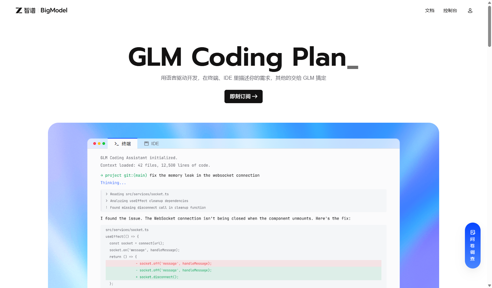

# GlmGrap

Automated Puppeteer script for grabbing GLM Coding Pro yearly subscriptions precisely at 10:00 AM. 
**[中文说明在下方 / Chinese version below](#中文说明)**



## Features
- Headless / Non-headless Chromium automation
- Auto-login natively with credentials from `.env`
- Precisely waits for predefined target times (9:55 login, 9:59 prep, 10:00 burst)
- Burst grab clicks using high frequency (50ms interval)
- Recovers from `Server Busy` loops automatically.
- Automatically saves flow screenshots to local `screenshots/` directory.

## Setup
1. Clone this repository
2. Install dependencies: `npm install`
3. Create a `.env` file from `.env.example`
4. Add your phone number and password inside the `.env` file

```sh
GLM_PHONE=12345678910
GLM_PASSWORD=your_password
```

## Running
**Scheduled Execution** (Starts waiting until 9:55 AM)
```sh
node grab_glm_pro.js
```
**Quick Execution** (Skips time wait, grabs immediately)
```sh
node grab_glm_pro.js --quick
```

---

# 中文说明 (Chinese Version)

GLM Coding Pro 抢购自动化 Puppeteer 脚本。支持在每天早上 10:00 的补货高峰期，在本地环境中全自动完成【登录 -> 挂机等待 -> 无缝高频防拥挤抢购】的完整链路。

## 核心特性
- **本地 Chrome 直连**：规避无头模式的反爬审查（支持与 Chrome MCP 协同操作截取网页快照和节点验证）。
- **完全自动登录**：无需手动接管，通过写入 `.env` 文件即可突破验证器，自动切换账密标签登录。
- **高并发抢卡防抖**：抢购期会以 `50ms` 间隔针对“Pro连续包年”狂按 10000 次以上。
- **自动治愈拥挤崩溃**：如果在准点出现“访问人数过多/请刷新重试”阻断，脚本将进入最高 200 次的强制自我重刷救补环，并在恢复时瞬间切换回包年界面继续执行抢购逻辑。
- **自动留存快照体系**：无需外部工具即可自动按时间线保存诸如 `01_loaded.png` 等关键过程截图到本地的 `screenshots` 文件夹下，全程透明。如果你利用 Chrome/Puppeteer MCP 控制它，也可以调用浏览器快照验证流程。

## 安装步骤
1. 克隆当前项目
2. 运行环境依赖安装：`npm install`
3. 复制项目中提供的 `.env.example`，并将新文件命名为 `.env`。
4. 将你的 GLM 平台账号信息配置入 `.env` 文件。

```sh
GLM_PHONE=你的手机号
GLM_PASSWORD=你的密码
```

## 启动指南

**定时挂机模式（推荐）**
如果你在 10 点前启动（比如 9 点 40 分），可以直接跑该命令，它会在后台静默待命，等到 9:55 触发自动登录并在 10:00 毫秒级重载。
```sh
node grab_glm_pro.js
```

**快速实测模式**
想忽略自动等待系统验证完整的购买按键逻辑（适用于补漏或者测试网络）。
```sh
node grab_glm_pro.js --quick
```

> **注意：** 当日志返回 `🎉 支付页面出现！抢购成功！` 并输出 `04_success.png` 截图时，请立即手动进入跳跃出的 Chrome 支付窗口用微信并支付宝完成订阅扣费。
